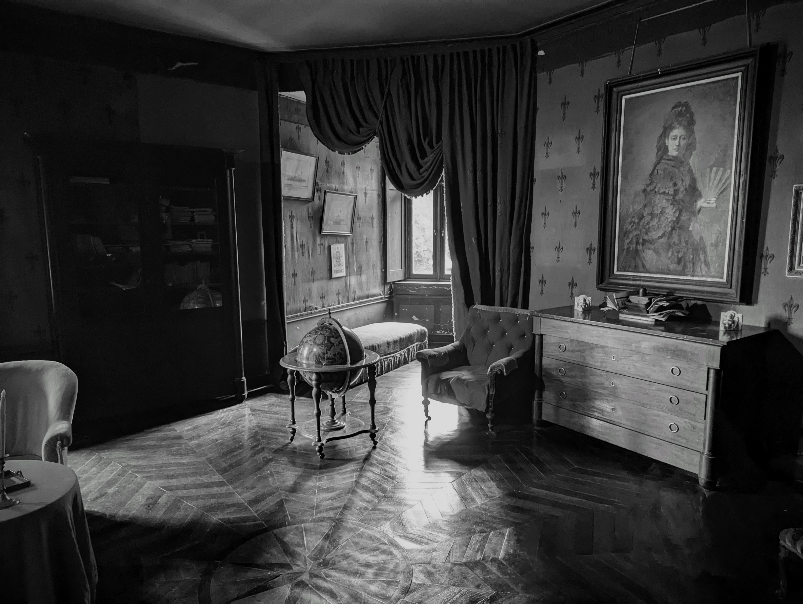

## Introduction

My name is Angelino Storm, but almost everyone calls me Jino, so you can too.

I've always had an interest and natural skill in computers and math and I've always liked to deepen my knowledge on anything.
I studied in university and got a BSc in Computer Science, and have been working in the field since 2019.

## Personal projects

### Premise & the first idea
So, recently I had been playing more and more with LLMs and coding together with some kind of AI agent and I figured it was very easy to start something with them. I had some small ideas here and there so I thought "How could I make this accessible for the world to use, perhaps without any cost at all even? Maybe there's services that offer something basic for free?". I understood that probably having a whole database and having whatever running on some backend would definitely come with a cost. So then I thought "Could I deploy somewhere for free a \*static\* website, but it actually communicates with some endpoint where a backend is running doing all the \*heavy\* work?". So I started with the most basic thing I could think of. A website that counts how many times the button has been clicked (since the latest deployment of the backend, because I didn't want to store a file with the number, I was fine having the number just saved in the process' memory and reset when I kill the process and build/compile/run it again). And so I did, and I'm running the "backend" on my home PC and the website is deployed here:  
[https://jino-click-app-poc.netlify.app](https://jino-click-app-poc.netlify.app)

### The second idea
I was playing League of Legends with my buddy from Greece, Apostolis. And we like to play the Arena and ARAM: Mayhem modes, but depending on what augments you get there's different items with different buffs and stats that will work best with your kit. So I wanted to search items that give to your champion Energized Attacks, and searching in the items for "energized" didn't show anything. So, I thought, why don't I just use an LLM to build a good search for me for League of Legends items, which doesn't depend only on the item's name and maybe a few more stats, but something like "energized" would also give me the items that give Energized Attacks to your champion, and whatever else I'd figure out down the road. And so this was made:  
[https://jino-lol-item-better-search.netlify.app](https://jino-lol-item-better-search.netlify.app)

### The genuinely useful idea
I've been going for rugby training twice a week with my buddy Keegan, and the coaches are good, but I'm not fast and I've never known anything about rugby before joining the boys here. So, they would mention different kinds of plays, and why we want this or that to happen and I'd always feel lost, and I've no idea what I'm doing, and I'm in a situation and I don't know what I should do know so I'd make panic choices which were bad or no choice which is maybe even worse. I just need to know the different kinds of plays that exist, and since I have always been extremely bad with my memory I would hear a specific name of a play we want to do and I'd try to get them to explain it to me again, but of course the training needs to keep going, so I'd get some sentences or words, and then we have to move, and then we find a few seconds again, and so I'd still be stuck and get nowhere (unless I take some time out of practice I guess, and ask someone to take their time to help me out etc). This got me thinking, why don't I just create the play in some way, with some kind of rugby UI so I can see everything and understand why this play is the one that's happening in this scenario, and what everyone should do. The best solution to me seemed to be an app where I can place players and create an "animation" in a way, out of some keyframes, where each keyframe basically puts a player somewhere and the ball somewhere, nothing else is really needed. I can create the whole play in there, see the ball being passsed, see where each player goes and why play A or play B helps with scoring a try. Eventually I want to be able to save different plays and name them, but what I have now is decent quality, without breaking easily, and I like how it's going (maybe by the time someone's reading this I've already updated the app to be better, who knows). You may have noticed I've been using only Netlify to deploy them, it just seems so convenient! I only drag and drop a folder with a single \`index.html\` file or something and there it is, a website available for the whole internet (and it works well for mobile too!):  
[https://jino-rugby-play-builder.netlify.app](https://jino-rugby-play-builder.netlify.app)

<hr>

## Credits

I found this kind of format for setting up a website on X (a.k.a. Twitter) and I decided to try it out.

I love it.

Thank you [Oskar Wickström](https://x.com/owickstrom) for creating this.

Github repo for The Monospace Web: [github.com/owickstrom/the-monospace-web](https://github.com/owickstrom/the-monospace-web)

<!-- Comments
Horizontal line break:
<hr>

Hide stuff with <details> element:
<details>
<summary>A short summary of the contents</summary>
<p>Hidden gems.</p>
</details>

Bulleted list:
* Banana
* Paper boat
* Cucumber

Ordered list:
1. Goals
1. Motivations
    1. Intrinsic
    1. Extrinsic
1. Second-order effects

Visualizing trees - regular unordered list with a `tree` class and a title on top "/dev/nvme0n1p2":
<ul class="tree"><li><p style="margin: 0;"><strong>/dev/nvme0n1p2</strong></p>
* usr                               
    * local                                                   
    * bin                           
    * games                         
        * solitaire
        * snake
        * tic-tac-toe
    * media                         
* media                             
* run                               
* tmp                               
</li></ul>

Table responsive to the monospace grid (only up to one column allowed to grow, the one with "width-auto", if all "width-min" they all same size and expand to fill width).
<table>
<thead>
  <tr>
    <th class="width-min">Name</th>
    <th class="width-auto">Dimensions</th>
    <th class="width-min">Position</th>
  </tr>
</thead>
<tbody>
  <tr>
    <td>name 1</td>
    <td>dimensions 1</td>
    <td>position 1</td>
  </tr>
  <tr>
    <td>name 2</td>
    <td>dimensions 2</td>
    <td>position 2</td>
  </tr>
</tbody>
</table>

Buttons:
<nav>
    <button>Prev</button>
    <button>Next</button>
</nav>

Inputs:
<form class="grid">
<label>First name <input type="text" placeholder="Placeholder..." /></label>
<label>Last name <input type="text" placeholder="Text goes here..." /></label>
<label>Age <input type="text" placeholder="Type age here..." value="30" /></label>
</form>

And radio buttons:

<form class="grid">
<label><input name="radio" type="radio" /> Option #1</label>
<label><input name="radio" type="radio" /> Option #2</label>
<label><input name="radio" type="radio" /> Option #3</label>
</form>

## Grids

Add the `grid` class to a container to divide up the horizontal space evenly for the cells.
Note that it maintains the monospace, so the total width might not be 100%.
Here are six grids with increasing cell count:
<div class="grid"><input readonly value="1" /></div>
<div class="grid"><input readonly value="1" /><input readonly value="2" /></div>
<div class="grid"><input readonly value="1" /><input readonly value="2" /><input readonly value="3" /></div>
<div class="grid"><input readonly value="1" /><input readonly value="2" /><input readonly value="3" /><input readonly value="4" /></div>
<div class="grid"><input readonly value="1" /><input readonly value="2" /><input readonly value="3" /><input readonly value="4" /><input readonly value="5" /></div>
<div class="grid"><input readonly value="1" /><input readonly value="2" /><input readonly value="3" /><input readonly value="4" /><input readonly value="5" /><input readonly value="6" /></div>
If we want one cell to fill the remainder, we set `flex-grow: 1;` for that particular cell.
<div class="grid"><input readonly value="1" /><input readonly value="2" /><input readonly value="3!" style="flex-grow: 1;" /><input readonly value="4" /><input readonly value="5" /><input readonly value="6" /></div>

ASCII Drawings:
We can draw in `<pre>` tags using https://en.wikipedia.org/wiki/Box-drawing_characters
```
╭─────────────────╮
│ MONOSPACE ROCKS │
╰─────────────────╯
```
To have it stand out a bit more, we can wrap it in a `<figure>` tag, and why not also add a `<figcaption>`.
<figure>
<pre>
┌───────┐ ┌───────┐ ┌───────┐
│Actor 1│ │Actor 2│ │Actor 3│
└───┬───┘ └───┬───┘ └───┬───┘
    │         │         │    
    │         │  msg 1  │    
    │         │────────►│    
    │         │         │    
    │  msg 2  │         │    
    │────────►│         │    
┌───┴───┐ ┌───┴───┐ ┌───┴───┐
│Actor 1│ │Actor 2│ │Actor 3│
└───────┘ └───────┘ └───────┘</pre>
<figcaption>Example: Message passing.</figcaption>
</figure>
Let's go wild and draw a chart!
<figure><pre>
                      Things I Have
                                              
    │                                     ████ Usable
15  │
    │                                     ░░░░ Broken
    │
12  │             ░            
    │             ░            
    │   ░         ░              
 9  │   ░         ░              
    │   ░         ░              
    │   ░         ░                    ░
 6  │   █         ░         ░          ░
    │   █         ░         ░          ░
    │   █         ░         █          ░
 3  │   █         █         █          ░
    │   █         █         █          ░
    │   █         █         █          ░
 0  └───▀─────────▀─────────▀──────────▀─────────────
      Socks     Jeans     Shirts   USB Drives
</pre></figure>

## Media

Media objects are supported, like images and video:


.webm/11)](https://upload.wikimedia.org/wikipedia/commons/e/e0/The_Center_of_the_Web_%281914%29.webm)

They extend to the width of the page, and add appropriate padding in the bottom to maintain the monospace grid.

.webm/11)](https://upload.wikimedia.org/wikipedia/commons/e/e0/The_Center_of_the_Web_%281914%29.webm)
-->
